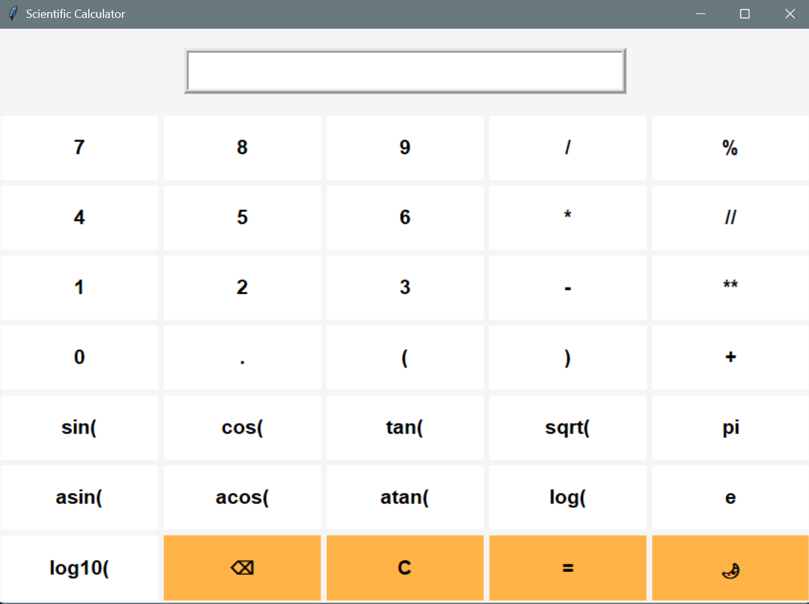
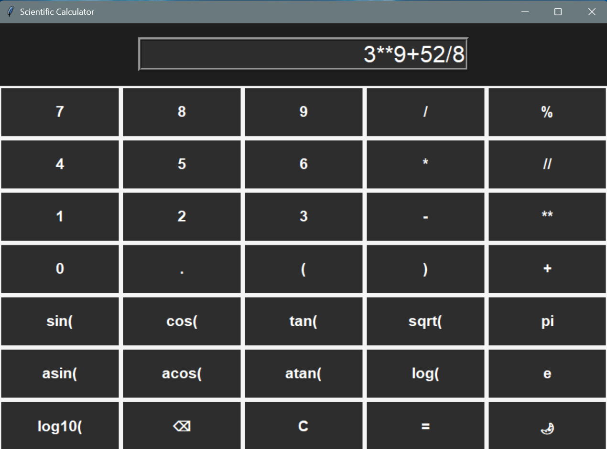

# Tkinter Calculator

A calculator made with Python and Tkinter.

## Preview

<table align="center">
<tr>
<td align="center">



<b>Light Mode</b>

</td>

<td align="center">



<b>Dark Mode</b>

</td>
</tr>
</table>

## Features
- Addition
- Subtraction
- Multiplication
- Division
- Exponentials
- Mudulus
- Floor Division
- Logarithms
- Exponentials
- Trigonometric Functions
- Inverse Trigonometric Functions

## Run

```bash
python calc.py
